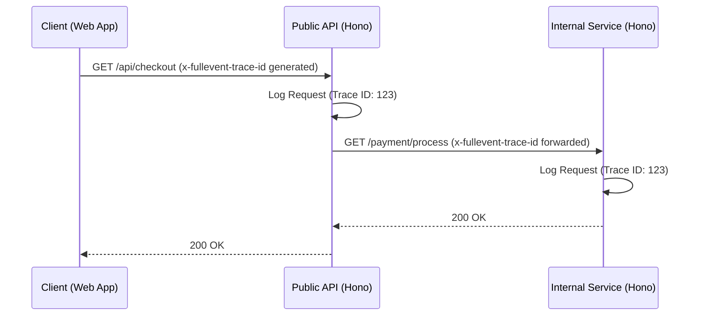

Distributed tracing allows you to track a single request as it flows through multiple services in your architecture. FullEvent uses the `x-fullevent-trace-id` header to correlate these events.

This guide will show you how to set up a full tracing pipeline from the client to your internal services.

## Architecture Overview

We will implement tracing across three layers:
1. **Client**: The frontend application initiating the request.
2. **Public API**: The entry point or Gateway (Service A).
3. **Internal Service**: A background service (Service B) called by the API.



## Step 1: Client Side Setup

On the client, you should generate a Trace ID for key actions so you can search for it later. Alternatively, if you don't send one, the first server will generate it and return it in the response.

Here is a simple fetch wrapper that handles this.

### `apps/web/lib/api-client.ts`

```typescript
export async function fetchWithTrace(input: RequestInfo, init?: RequestInit) {
  const headers = new Headers(init?.headers);
  
  // Optional: Generate a distinct ID on the client if you want to track it immediately
  // otherwise, the server will return one.
  const traceId = crypto.randomUUID();
  headers.set('x-fullevent-trace-id', traceId);

  console.log('Distrubuted Trace ID:', traceId);

  const response = await fetch(input, {
    ...init,
    headers,
  });

  // If the server generated the ID, you can read it here
  const finalTraceId = response.headers.get('x-fullevent-trace-id');
  
  return response;
}
```

## Step 2: Public API (Entry Point)

Your public API needs to:
1. Accept the incoming specific trace header.
2. Use it for its own logging.
3. Forward it to any downstream services.

The Hono middleware handles #1 and #2 automatically.

### `apps/api/src/index.ts`

```typescript
import { Hono } from 'hono';
import { createFullEventMiddleware } from '@fullevent/node-sdk';

const app = new Hono();

app.use('*', createFullEventMiddleware({
  apiKey: process.env.FULLEVENT_API_KEY!,
  serviceName: 'public-api'
}));

app.get('/api/checkout', async (c) => {
  // Get the trace ID from the current context
  const traceId = c.req.header('x-fullevent-trace-id');

  // Call the internal service, propagating the header
  await fetch('http://internal-service:3000/process', {
      headers: {
          'x-fullevent-trace-id': traceId
      }
  });

  return c.json({ status: 'processing' });
});

export default app;
```

## Step 3: Internal Service

The internal service looks exactly the same. It receives the header and logs it. Because it was passed from the API, it shares the same ID.

### `apps/internal-service/src/index.ts`

```typescript
import { Hono } from 'hono';
import { createFullEventMiddleware } from '@fullevent/node-sdk';

const app = new Hono();

// This middleware will see the header sent by 'public-api' and use it.
app.use('*', createFullEventMiddleware({
  apiKey: process.env.FULLEVENT_API_KEY!,
  serviceName: 'internal-payment-service'
}));

app.get('/process', (c) => {
  return c.json({ result: 'ok' });
});

export default app;
```

## Result

When you look in your FullEvent dashboard, you will see two distinct events that share the exact same `request_id`. Filtering by that ID will show you the entire timeline of the operation across your stack.

### Why two events?

You might wonder why we don't merge them into one single event.

In the **Wide Event** model, every service is responsible for emitting its own "unit of work". 
- **Service A** emits an event for "Handling the User Request".
- **Service B** emits an event for "Processing the Payment".

Keeping them separate allows you to:
1. **Isolate Failures**: If Service B fails, you see exactly which service threw the error.
2. **Analyze Latency**: You can see that Service A took 500ms, but 450ms of that was waiting for Service B.
3. **Scale**: In highly distributed systems, merging events at the source is complex and error-prone. Linking them by ID is robust and scalable.
